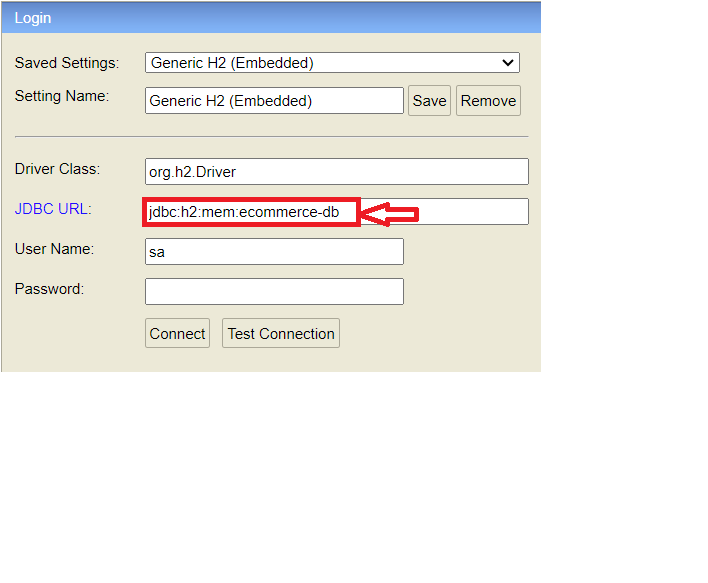
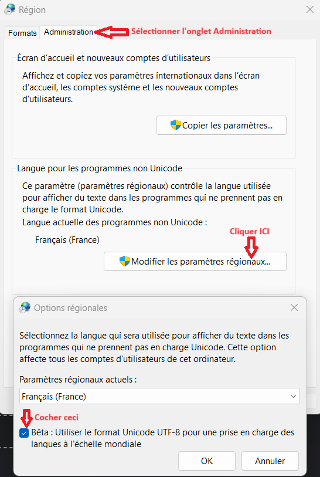

<a name="readme-top"></a>
<br />
<div align="center">
  <a href="https://github.com/othneildrew/Best-README-Template">
    
  </a>
  <h3 align="center">Tax Calculator</h3>
 <p align="center">
    Calcul de taxes sur un panier d'achat
    <br />
    <br />
    <a href="https://github.com/othneildrew/Best-README-Template/issues">Signaler un Bug</a>
    ·
    <a href="https://github.com/othneildrew/Best-README-Template/issues">Demander une nouvelle Fonctionnalité</a>
  </p>
</div>

<!-- TABLE OF CONTENTS -->
<details>
  <summary>Table des matières</summary>
  <ol>
    <li>
      <a href="#about-the-project">À propos</a>
      <ul>
        <li><a href="#built-with">Construit avec</a></li>
      </ul>
    </li>
    <li>
      <a href="#Installation">Installation</a>
      <ul>
        <li><a href="#Prérequis">Prérequis</a></li>
      </ul>
    </li>
    <li>
        <a href="#Utilisation">Utilisation</a>
        <ul>
            <li><a href="#Troubleshooting">Troubleshooting</a></li>
        </ul>
    </li>
    <li><a href="#licence">licence</a></li>
    <li><a href="#contact">Contact</a></li>
  </ol>
</details>

<!-- ABOUT THE PROJECT -->
## About The Project

Aucune taxe sur la valeur ajoutée (TVA) n'est appliquée sur les produits de premières nécessités, à savoir la nourriture et les médicaments.

Une taxe sur la valeur ajoutée (TVA) réduite de 10% est appliquée sur les livres.

Une taxe sur la valeur ajoutée (TVA) normale de 20% est appliquée sur tous les autres produits.

Une taxe additionnelle de 5% est appliquée sur les produits importés, sans exception (la nourriture et les médicaments sont compris).

Le montant de chacune des taxes est arrondi aux 5 centimes supérieurs, selon la règle suivante :

| Taxe calculée | Taxe imputée |
|---------------|--------------|
|          0.95 |         0.95 |
|          0.99 |         1.00 |
|          1.00 |         1.00 |
|          1.01 |         1.05 |
|          1.02 |         1.05 |

Lorsque l'on passe une commande, une facture est émise listant chaque produit ainsi que leur prix TTC (Toute Taxe Comprise).

Au bas de la facture figurent le montant total TTC de la commande ainsi que le montant total des taxes.

Le montant TTC d'un produit est calculé comme suit :

P<sub>ttc</sub> = P<sub>ht</sub> + arrondi(P<sub>ht</sub>*tva/100) + arrondi(P<sub>ht</sub>*ti/100)

Avec :
* P<sub>ttc</sub> : Prix Toute Taxe Comprise
* P<sub>ht</sub> : Prix hors taxes
* tva : Taxe sur la valeur ajoutée
* ti : Taxe d'importation
* arrondi : Fonction réalisant l'arrondi en respectant la règle énoncée ci-dessus.

Écrire une application, exécutable en Java 8 ou supèrieure, qui imprime la facture détaillée pour chacun des paniers suivants :

### Panier 1

#### Input
* 2 livres à 12.49€
* 1 CD musical à 14.99€
* 3 barres de chocolat à 0.85€
#### Output
* 2 livres à 12.49€ : 27.48€ TTC
* 1 CD musical à 14.99€ : 17.99€ TTC
* 3 barres de chocolat à 0.85€ : 2.55€ TTC

Montant des taxes : 5.50€

Total : 48.02€

### Panier 2

#### Input
* 2 boîtes de chocolats importée à 10€
* 3 flacons de parfum importé à 47.50€
#### Output
* 2 boîtes de chocolats importée à 10€ : 21€
* 3 flacons de parfum importé à 47.50€ : 178.2€

Montant des taxes : 36.70€

Total : 199.20€

### Panier 3

#### Input
* 2 flacons de parfum importé à 27.99€
* 1 flacon de parfum à 18.99€
* 3 boîtes de pilules contre la migraine à 9.75€
* 2 boîtes de chocolats importés à 11.25€
#### Output
* 2 flacons de parfum importé à 27.99€ : 69.98€
* 1 flacon de parfum à 18.99€ : 22.79€
* 3 boîtes de pilules contre la migraine à 9.75€ : 29.25€
* 2 boîtes de chocolats importés à 11.25€ : 23.70€

Montant des taxes : 19.00€

Total : 145.72€
### Construit avec
* [![Spring-Boot][Spring-Boot]][Spring-url]
* [![Spring-Data][Spring-Data]][Spring-Data-url]
* [![H2-DATABASE][H2-DATABASE]][Spring-Data-url]

## Installation
Tout d'abord cloner ce dépôt avec la commande:

```bash
git clone https://github.com/ronebeny78/tax-calculator.git
```

### Prérequis
installer un JDK 17 ou supérieur :

* [JDK 17](https://www.oracle.com/java/technologies/downloads/#java17)

## Utilisation
La commande suivante démarre l'application:

```bash
 ./mvnw spring-boot:run
```
* Au démarrage une base de données H2 est initialisée avec un catalogue produit, les règles de calcul des différentes taxes seront appliquées en utilisant le design pattern decorator.
* Après l'initialisation de la base produit, les 3 paniers d'achat seront ajoutés comme point d'entrée. 
* La dernière étape consiste à valider les paniers, puis générer les commandes et les factures correspondantes.

la base de donnée H2 est accessible en local à partir de l'URL suivante:
* [localhost:8082/h2-console/login.jsp](http://localhost:8082/h2-console/login.jsp)




## Troubleshooting
Si vous rencontrez un problème d'affichage au niveau de la console avec le symbole &euro;, il faudrait vérifier l'encodage de votre termial Windows comme suite:



## Licence

## Contact
[Spring-Boot]: https://img.shields.io/badge/SpringBoot-6DB33F?style=for-the-badge&logo=springboot&logoColor=white
[Spring-url]: https://spring.io/projects/spring-boot/
[Spring-Data]: https://img.shields.io/badge/SpringData-6DB33F?style=for-the-badge&logo=spring&logoColor=white
[Spring-Data-url]: https://spring.io/projects/spring-data/
[H2-DATABASE]: https://img.shields.io/badge/H2-0078D4?style=for-the-badge&logo=databricks&logoColor=white
[H2-URL]: https://www.h2database.com/html/main.html
